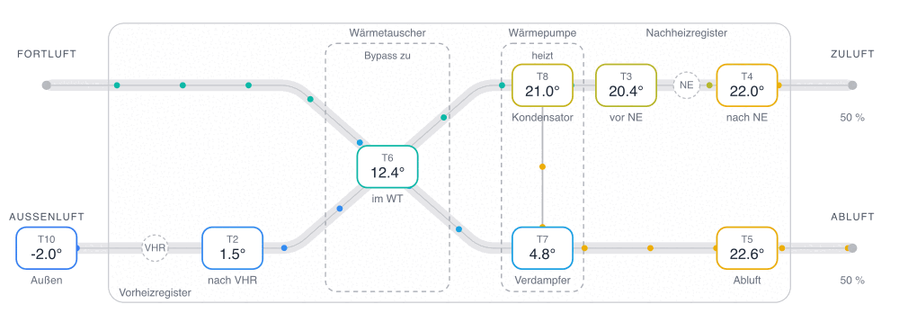
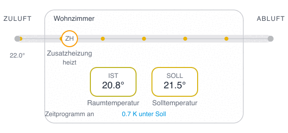

# Schwörer Lüftung Cards

[](https://github.com/josa42/homeassistant-schwoerer-lueftung-cards/releases)
[](LICENSE)
[](https://hacs.xyz/)

Dashboard cards for the [Schwörer Lüftung integration](https://github.com/josa42/homeassistant-schwoerer-lueftung).

<br><br>

## WGT Luftweg



Every temperature sensor at its position in the air path. Supply and exhaust
cross in the heat exchanger, and the dots move at a speed set by the fans.

```yaml
type: custom:wgt-air-flow-card
device_id: a3f9c2e17b8d4056af21c9e4d7b60385
```

It is wide, so give it a section that spans the view:

```yaml
type: sections
max_columns: 2
sections:
  - type: grid
    column_span: 2
    cards:
      - type: custom:wgt-air-flow-card
        device_id: a3f9c2e17b8d4056af21c9e4d7b60385
```

<br><br>

## WGT Raum



One room: measured against target, the auxiliary heater, and the supply air
reaching it. Each room is its own device, so one card shows one room.

```yaml
type: custom:wgt-room-card
device_id: 6b2e84d05c1af739e8b4260d95c1f7a2
```

<br><br>

## Configuration

Pick the device in the visual editor. That is the whole configuration. Both
cards work out their entities from it, and name themselves.

<br><br>

## Requirements

- Home Assistant **2026.9.0** or newer
- The [Schwörer Lüftung integration](https://github.com/josa42/homeassistant-schwoerer-lueftung), 2.1.0 or newer
- A WGT device, since WRT units do not expose these sensors

<br><br>

## Installation

[](https://my.home-assistant.io/redirect/hacs_repository/?owner=josa42&repository=homeassistant-schwoerer-lueftung-cards&category=plugin)

Confirm the prompt, click Download, then hard refresh the browser.

[Manual installation](docs/manual_installation.md) covers adding the repository
by hand and installing without HACS.

<br><br>

## Documentation

- [Reference](docs/reference.md): which entity fills which position, and troubleshooting
- [Changelog](CHANGELOG.md)

<br><br>

## License

[MIT](LICENSE)
